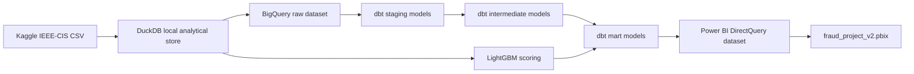

# Fraud Project

End-to-end fraud analytics project built on the IEEE-CIS Fraud Detection dataset. The project turns raw Kaggle CSV files into governed BigQuery datasets, dbt models, machine-learning risk scores, and an executive Power BI report.

The business question is simple: where does fraud concentrate, and how should an operations team prioritize review capacity?

## Executive Summary

Fraud is a low-frequency event in the dataset, but it is not random. Product, identity coverage, payment attributes, email domains, transaction amount bands, and model risk bands show clear concentration patterns. The final Power BI report is structured as a senior banking fraud analyst presentation: first the portfolio risk, then concentration drivers, then amount/time behavior, then payment and email segments, then model-based review queues, and finally data quality evidence.

## Architecture



BigQuery datasets used by the production target:

- `fraud_project_raw`
- `fraud_project_staging`
- `fraud_project_intermediate`
- `fraud_project_mart`
- `fraud_project_powerbi`

## Tech Stack

- Data ingestion: Kaggle CLI, Python, DuckDB
- Warehouse: Google BigQuery
- Transformation: dbt Core, dbt-bigquery, custom dbt tests
- Machine learning: LightGBM, scikit-learn, time-based validation
- Reporting: Power BI Desktop, DirectQuery, native visuals
- Quality gates: dbt tests, Python validation scripts, GitHub Actions
- Infrastructure definition: Terraform dataset manifest for BigQuery

## Repository Structure

```text
fraud_project/
├── .github/workflows/        # CI, dbt validation, docs workflow
├── analyses/                 # dbt ad-hoc analysis area
├── bigquery/                 # BigQuery deployment notes
├── docs/                     # project documentation and business narrative
├── infra/bigquery/           # Terraform dataset definitions
├── macros/                   # dbt macros and generic tests
├── models/                   # staging, intermediate, marts, powerbi dbt models
├── powerbi/                  # PBIX, DAX layer, report assets, report guide
├── profiles/                 # sanitized dbt profile templates
├── scripts/                  # local deployment and validation commands
├── src/                      # ingestion, ML, exports, PBIX build scripts
└── tests/                    # dbt singular tests and Python tests
```

## Data Setup

The raw Kaggle files are not committed to the repository. Download them with the Kaggle CLI:

```bash
kaggle competitions download -c ieee-fraud-detection -p data/raw/kaggle_ieee_fraud
unzip -o data/raw/kaggle_ieee_fraud/ieee-fraud-detection.zip -d data/raw/kaggle_ieee_fraud
```

Expected files:

- `train_transaction.csv`
- `train_identity.csv`
- `test_transaction.csv`
- `test_identity.csv`
- `sample_submission.csv`

## Environment Setup

Python 3.11 or 3.12 is recommended.

```bash
python -m venv .venv
source .venv/bin/activate
python -m pip install --upgrade pip
python -m pip install -r requirements.txt
python -m pip install -r requirements-dev.txt
```

On Windows PowerShell:

```powershell
python -m venv .venv
.\.venv\Scripts\Activate.ps1
python -m pip install --upgrade pip
python -m pip install -r requirements.txt
python -m pip install -r requirements-dev.txt
```

Create a local dbt profile from the sanitized template:

```bash
cp profiles/profiles.example.yml profiles/profiles.yml
```

For BigQuery, set credentials through environment variables. Do not commit service-account files.

```bash
export GCP_PROJECT_ID="your-gcp-project"
export BIGQUERY_LOCATION="US"
export GOOGLE_APPLICATION_CREDENTIALS="/secure/path/service-account.json"
```

## Run Locally

Build the local analytical store and model scores:

```bash
python src/prepare_raw_and_ml.py
dbt deps
dbt build --project-dir . --profiles-dir profiles --profile ieee_fraud_detection --target dev
python src/export_powerbi_and_charts.py
python src/build_fraud_project_v2_pbix.py
python scripts/validate_powerbi_report.py
```

## BigQuery Deployment

PowerShell deployment:

```powershell
$env:GCP_PROJECT_ID = "your-gcp-project"
$env:BIGQUERY_LOCATION = "US"
$env:GOOGLE_APPLICATION_CREDENTIALS = "C:\secure\path\service-account.json"

.\scripts\deploy_bigquery.ps1 `
  -Credentials $env:GOOGLE_APPLICATION_CREDENTIALS `
  -ProjectId $env:GCP_PROJECT_ID `
  -Location $env:BIGQUERY_LOCATION `
  -ReportingDataset "fraud_project_powerbi"
```

Minimum IAM roles:

- BigQuery Job User
- BigQuery Data Editor
- BigQuery Data Viewer

Terraform dataset definitions are available under `infra/bigquery/`.

## ML Scoring Layer

The scoring script trains a `LightGBMClassifier` with a time-based validation split using the last 20% of `TransactionDT` as holdout data. Outputs include:

- `raw.ml_predictions`
- `raw.feature_importance`
- validation ROC curve data
- model metrics in `raw_profile.json`

The model is used as a review-prioritization layer, not as an automated decline engine.

Current validation design:

- Algorithm: LightGBM binary classifier
- Validation: time-based holdout
- Primary metric: ROC-AUC
- Secondary metric: average precision
- Risk bands: p80, p95, p99 score thresholds

Latest local validation snapshot:

- ROC-AUC: 0.9167
- Average precision: 0.5308
- Features used: 206
- Categorical features: 26

## Power BI Report

Main deliverable:

```text
powerbi/fraud_project_v2.pbix
```

The report uses BigQuery DirectQuery and contains six Turkish executive pages:

1. Yönetici Özeti
2. Risk Konsantrasyonu
3. Tutar ve Zaman Analizi
4. Ödeme ve Email Segmentleri
5. Model Skorlama ve Risk Bantları
6. Veri Kalitesi ve Mimari

Report exports and supporting visuals are stored in `powerbi/assets/`. DAX measures are documented in `powerbi/dax/fraud_project_measures.dax`.

## Quality Gates

```bash
ruff check .
pytest
pip-audit -r requirements.txt --ignore-vuln PYSEC-2024-277
dbt build --project-dir . --profiles-dir profiles --profile ieee_fraud_detection --target dev
python scripts/validate_powerbi_report.py
```

The Power BI validator checks package integrity, page count, visual type allowlist, missing image resources, unsafe fields, raw field-label leakage, native title leakage, and text clipping risk.

## Documentation

- [Summary](docs/01_summary.md)
- [Tech Stack](docs/02_tech_stack.md)
- [Analysis Hypotheses](docs/03_analysis_hypotheses.md)
- [ML Ideas](docs/04_ml_ideas.md)
- [Data Dictionary](docs/data_dictionary.md)
- [Modeling Decisions](docs/modeling_decisions.md)
- [Security and Secrets](docs/security_and_secrets.md)
- [Power BI Report Guide](docs/powerbi_report_guide.md)
- [QA Acceptance Checklist](docs/qa_acceptance_checklist.md)

## License

Code and documentation are released under the MIT License. The Kaggle dataset is not redistributed; users must download it from Kaggle and comply with the competition terms.
