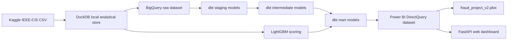
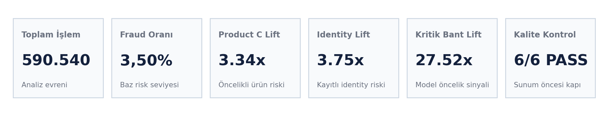
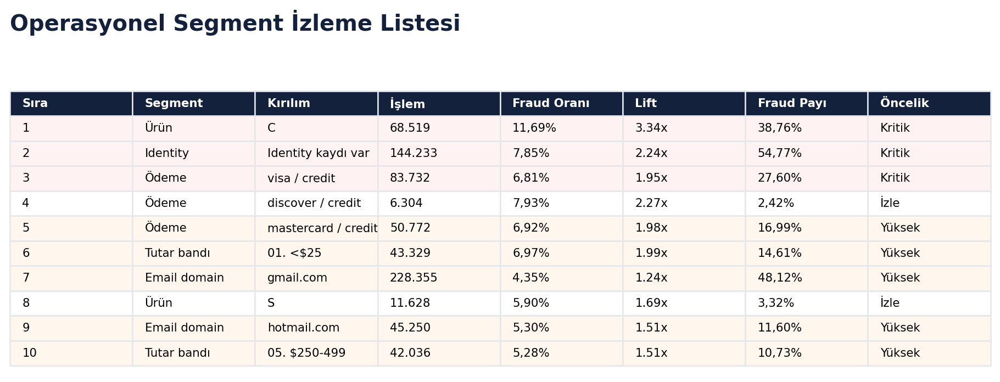
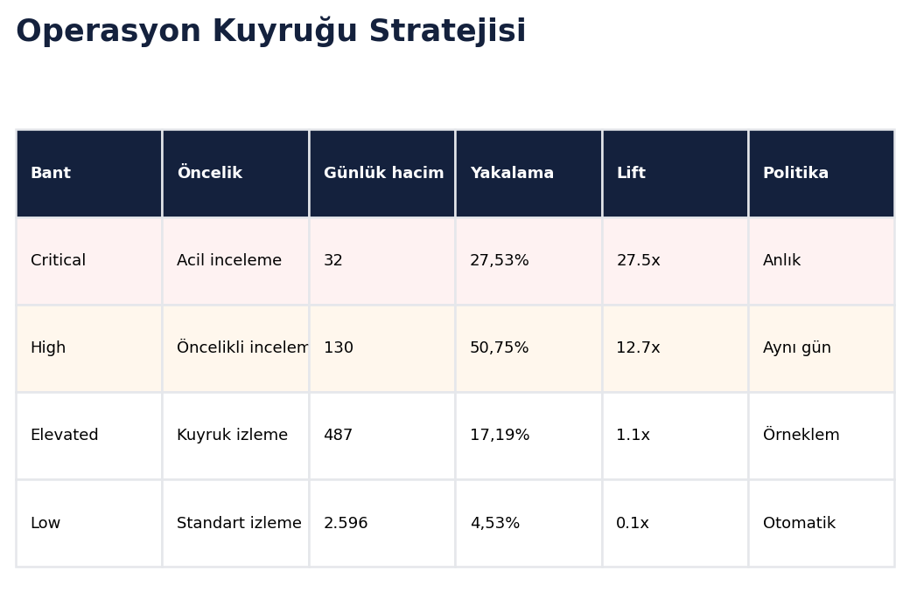

# Fraud Project

End-to-end fraud analytics project built on the IEEE-CIS Fraud Detection dataset. The project turns raw Kaggle CSV files into governed BigQuery datasets, dbt models, machine-learning risk scores, and an executive Power BI report.

The business question is simple: where does fraud concentrate, and how should an operations team prioritize review capacity?

## Problem Statement

Financial fraud is a low-prevalence, high-impact risk: the baseline fraud rate is only 3.50%, so portfolio averages hide the segments that actually drive operational exposure. This project builds an analytics and scoring layer that identifies where fraud concentrates and converts model scores into review queues an operations team can act on.

## Key Findings

- Product risk is concentrated: Product C has an 11.7% fraud rate, 3.34x lift, and 38.8% of fraud labels while representing 68,519 transactions.
- Identity availability is an analytical signal: only 144,233 of 590,540 train transactions have identity records, creating a 24.42% identity coverage rate; identity-present transactions show 7.85% fraud rate and 2.24x lift.
- Model ranking is strong enough for prioritization: the LightGBM validation ROC-AUC is 0.9167 and the average precision / AUC-PR proxy is 0.5308.
- The top-score region is operationally valuable: the top 10% validation score band has 7.24x lift versus the validation fraud baseline.
- The recommended High + Critical queue reviews about 5.06% of validation transactions while capturing 59.4% of fraud labels at 40.4% precision.

## Executive Summary

Fraud is a low-frequency event in the dataset, but it is not random. Product, identity coverage, payment attributes, email domains, transaction amount bands, and model risk bands show clear concentration patterns. The final Power BI report is structured as a senior banking fraud analyst presentation: first the portfolio risk, then concentration drivers, then amount/time behavior, then payment and email segments, then model-based review queues, and finally data quality evidence.

Portfolio snapshot:

- Total transactions profiled: 590,540
- Fraud-labeled transactions: 20,663
- Baseline fraud rate: 3.50%
- Total transaction amount: $79.7M
- Fraud-labeled amount: $3.08M
- Recommended review policy: start with the High + Critical queue, covering 5.06% of validation transactions and 59.4% of fraud labels in the validation holdout.

## Architecture Diagram



BigQuery datasets used by the production target:

- `fraud_project_raw`
- `fraud_project_staging`
- `fraud_project_intermediate`
- `fraud_project_mart`
- `fraud_project_powerbi`

## Tech Stack

- Data ingestion: Kaggle CLI, Python, DuckDB
- Warehouse: Google BigQuery
- Transformation: dbt Core, dbt-bigquery, custom dbt tests
- Machine learning: LightGBM, scikit-learn, time-based validation
- Reporting: Power BI Desktop, DirectQuery, native visuals
- Live dashboard: FastAPI, static HTML/CSS/JavaScript, BigQuery client
- Quality gates: dbt tests, Python validation scripts, GitHub Actions
- Infrastructure definition: Terraform dataset manifest for BigQuery

## Repository Structure

```text
fraud_project/
|-- .github/workflows/        # CI, dbt validation, docs workflow
|-- analyses/                 # dbt ad-hoc analysis area
|-- bigquery/                 # BigQuery deployment notes
|-- config/dbt/               # sanitized dbt profile templates
|-- docs/                     # project documentation and business narrative
|-- infra/bigquery/           # Terraform dataset definitions
|-- macros/                   # dbt macros and generic tests
|-- models/                   # staging, intermediate, marts, powerbi dbt models
|-- powerbi/                  # PBIX, DAX layer, report assets, report guide
|-- scripts/                  # local deployment and validation commands
|-- src/                      # ingestion, ML, exports, PBIX build scripts
|-- webapp/                   # FastAPI + browser dashboard over BigQuery
`-- tests/                    # dbt singular tests and Python tests
```

## Data Setup

The raw Kaggle files are not committed to the repository. Download them with the Kaggle CLI:

```bash
kaggle competitions download -c ieee-fraud-detection -p data/raw/kaggle_ieee_fraud
unzip -o data/raw/kaggle_ieee_fraud/ieee-fraud-detection.zip -d data/raw/kaggle_ieee_fraud
```

Expected files:

- `train_transaction.csv`
- `train_identity.csv`
- `test_transaction.csv`
- `test_identity.csv`
- `sample_submission.csv`

## Environment Setup

Python 3.11 or 3.12 is recommended.

```bash
python -m venv .venv
source .venv/bin/activate
python -m pip install --upgrade pip
python -m pip install -r requirements.txt
python -m pip install -r requirements-dev.txt
```

On Windows PowerShell:

```powershell
python -m venv .venv
.\.venv\Scripts\Activate.ps1
python -m pip install --upgrade pip
python -m pip install -r requirements.txt
python -m pip install -r requirements-dev.txt
```

The dbt profile templates under `config/dbt/` are sanitized and use environment variables. For BigQuery, set credentials through environment variables. Do not commit service-account files.

```bash
export GCP_PROJECT_ID="your-gcp-project"
export BIGQUERY_LOCATION="US"
export GOOGLE_APPLICATION_CREDENTIALS="<private-service-account-json-path>"
```

## Run Locally

Build the local analytical store and model scores:

```bash
python src/prepare_raw_and_ml.py
dbt deps
dbt build --project-dir . --profiles-dir config/dbt --profile ieee_fraud_detection --target dev
python src/export_powerbi_and_charts.py
python src/build_fraud_project_v2_pbix.py
python scripts/validate_powerbi_report.py
```

## BigQuery Deployment

PowerShell deployment:

```powershell
$env:GCP_PROJECT_ID = "your-gcp-project"
$env:BIGQUERY_LOCATION = "US"
$env:GOOGLE_APPLICATION_CREDENTIALS = "<private-service-account-json-path>"

.\scripts\deploy_bigquery.ps1 `
  -Credentials $env:GOOGLE_APPLICATION_CREDENTIALS `
  -ProjectId $env:GCP_PROJECT_ID `
  -Location $env:BIGQUERY_LOCATION `
  -ReportingDataset "fraud_project_powerbi"
```

Minimum IAM roles:

- BigQuery Job User
- BigQuery Data Editor
- BigQuery Data Viewer

Terraform dataset definitions are available under `infra/bigquery/`.

## Results and Visualizations

The final report is designed for executive review, not exploratory notebook browsing. It focuses on six questions:

| Question | Primary evidence |
|---|---|
| How large is the fraud problem? | `pbi_executive_kpis`, `mart_fraud_summary` |
| Where does risk concentrate? | `pbi_product_risk`, `pbi_identity_risk`, `pbi_segment_watchlist` |
| Do amount and time patterns matter? | `pbi_amount_bands`, `pbi_time_amount_signals`, `pbi_daily_drift` |
| Which payment and email segments need monitoring? | `pbi_payment_heatmap`, `pbi_email_domain_risk` |
| Can the model prioritize review queues? | `pbi_model_risk_bands`, `pbi_threshold_simulation`, `pbi_review_strategy` |
| Is the data pipeline trustworthy? | `pbi_quality_contract`, `pbi_report_readiness`, dbt tests |

Current validation snapshot:

| Result | Value |
|---|---:|
| Total profiled train transactions | 590,540 |
| Fraud-labeled train transactions | 20,663 |
| Baseline fraud rate | 3.50% |
| Identity coverage rate | 24.42% |
| ROC-AUC | 0.9167 |
| Average precision / AUC-PR proxy | 0.5308 |
| Top 10% validation score lift | 7.24x |
| High + Critical precision | 40.4% |
| High + Critical recall | 59.4% |
| High + Critical false-positive rate | 3.12% |
| High + Critical review workload | 5.06% |

## ML Scoring Layer

The scoring script trains a `LightGBMClassifier` with a time-based validation split using the last 20% of `TransactionDT` as holdout data. Outputs include:

- `raw.ml_predictions`
- `raw.feature_importance`
- validation ROC curve data
- model metrics in `raw_profile.json`

The model is used as a review-prioritization layer, not as an automated decline engine.

Current validation design:

- Algorithm: LightGBM binary classifier
- Validation: time-based holdout
- Primary metric: ROC-AUC
- Secondary metric: average precision
- Risk bands: p80, p95, p99 score thresholds

Latest local validation snapshot:

- ROC-AUC: 0.9167
- Average precision: 0.5308
- High + Critical operating point: 40.4% precision, 59.4% recall, 3.12% false-positive rate, 5.06% review workload
- Features used: 206
- Categorical features: 26

Model explainability artifacts:

- [Feature importance](powerbi/assets/05_feature_importance.png)
- [SHAP summary](powerbi/assets/26_shap_summary.png)
- [Precision-recall curve](docs/assets/precision_recall_curve.svg)
- [Threshold simulation and business impact](docs/banking_business_impact.md)

Validation evidence:

| Metric | Value |
|---|---:|
| ROC-AUC | 0.9167 |
| Average precision / AUC-PR proxy | 0.5308 |
| Validation top 10% lift | 7.24x |
| Validation High + Critical precision | 40.4% |
| Validation High + Critical recall | 59.4% |
| Validation High + Critical false-positive rate | 3.12% |
| Validation High + Critical workload share | 5.06% |

## Power BI Report

Main deliverable:

```text
powerbi/fraud_project_v2.pbix
```

The report uses BigQuery DirectQuery and contains six executive pages:

1. Executive summary
2. Risk concentration
3. Amount and time analysis
4. Payment and email segments
5. Model scoring and risk bands
6. Data quality and architecture

Report exports and supporting visuals are stored in `powerbi/assets/`. DAX measures are documented in `powerbi/dax/fraud_project_measures.dax`.

## Live Web Dashboard

The project also includes a browser-based presentation layer that reads the same dbt-built BigQuery reporting tables as the Power BI model. This is useful when Power BI Desktop connectivity is unavailable or when the presentation needs to be delivered from a lightweight web interface.

Production dashboard:

```text
https://fraud-project-web.vercel.app
```

Run locally:

```powershell
$env:GCP_PROJECT_ID = "your-gcp-project"
$env:BQ_DATASET = "fraud_project_powerbi"
$env:BIGQUERY_LOCATION = "US"
$env:GOOGLE_APPLICATION_CREDENTIALS = "<private-service-account-json-path>"

uvicorn webapp.main:app --host 127.0.0.1 --port 8000
```

Then open `http://127.0.0.1:8000`.

The API reads pre-aggregated `pbi_*` tables only and exposes a cached `/api/dashboard` payload for the executive web dashboard.

Vercel deploys the `webapp/` folder as the project root. The production runtime uses Vercel environment variables, including `GOOGLE_APPLICATION_CREDENTIALS_JSON_B64`, instead of local credential files.

## Dashboard Preview







## Quality Gates

```bash
ruff check .
pytest
pip-audit -r requirements.txt --ignore-vuln PYSEC-2024-277
dbt build --project-dir . --profiles-dir config/dbt --profile ieee_fraud_detection --target dev
python scripts/validate_powerbi_report.py
```

Latest production verification:

- dbt production build: `PASS=123 WARN=0 ERROR=0 SKIP=0 NO-OP=1 TOTAL=124`
- dbt project scope: 33 models, 90 data tests, 8 sources, 1 exposure
- Critical BigQuery row counts verified: train transactions 590,540; train identity 144,233; Power BI fact 590,540
- GitHub Actions: Python quality, pytest, Power BI package validation, dependency audit, and dbt parse/build workflow

The Power BI validator checks package integrity, page count, visual type allowlist, missing image resources, unsafe fields, raw field-label leakage, native title leakage, and text clipping risk.

## Documentation

- [Summary](docs/01_summary.md)
- [Tech Stack](docs/02_tech_stack.md)
- [Analysis Hypotheses](docs/03_analysis_hypotheses.md)
- [ML Ideas](docs/04_ml_ideas.md)
- [Architecture](docs/architecture.md)
- [Data Dictionary](docs/data_dictionary.md)
- [IEEE-CIS Dataset Methodology Notes](docs/ieee_cis_dataset_methodology.md)
- [Modeling Decisions](docs/modeling_decisions.md)
- [Model Results](docs/model_results.md)
- [Model Validation Evidence](docs/model_validation_evidence.md)
- [Banking Business Impact](docs/banking_business_impact.md)
- [Regulatory Context](docs/regulatory_context.md)
- [Operational Playbook](docs/operational_playbook.md)
- [Security and Secrets](docs/security_and_secrets.md)
- [Power BI Report Guide](docs/powerbi_report_guide.md)
- [QA Acceptance Checklist](docs/qa_acceptance_checklist.md)

## License

Code and documentation are released under the MIT License. The Kaggle dataset is not redistributed; users must download it from Kaggle and comply with the competition terms.
