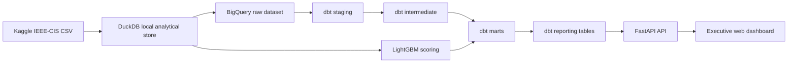

# 02 - Tech Stack

## Architecture Flow

## Data Ingestion

- Source: IEEE-CIS Fraud Detection Kaggle files.
- Local preparation: Python and DuckDB.
- Warehouse target: `fraud_project_raw`.
- Raw Kaggle files are not committed to the repository.

## Warehouse

The production BigQuery target uses five datasets:

| Dataset | Purpose |
|---|---|
| `fraud_project_raw` | Raw Kaggle tables and model support outputs |
| `fraud_project_staging` | Typed and renamed source views/tables |
| `fraud_project_intermediate` | Joined transaction and identity features |
| `fraud_project_mart` | Analytical marts for fraud metrics, risk bands, and model scores |
| `fraud_project_reporting` | Web-dashboard-ready reporting tables |

This separation keeps raw data, transformation logic, analytical marts, and presentation contracts independent.

## Transformation Layer

dbt Core is the transformation framework. The project runs from the repository root with sanitized profiles under `config/dbt/`.

Model layers:

- `models/staging`: source type normalization and basic cleaning.
- `models/intermediate`: transaction and identity joins, segment features, amount/time derivations.
- `models/marts`: fraud summary, segment metrics, model predictions, risk-band statistics, and data quality.
- `models/reporting`: pre-aggregated dashboard contract tables for the web API.

## Machine Learning

- Algorithm: LightGBM binary classifier.
- Validation: time-based holdout using the final 20% of `TransactionDT` order.
- Current model feature count: 206.
- Categorical feature count: 26.
- Primary metrics: ROC-AUC, average precision, precision, recall, false-positive rate, lift, workload share.

Model outputs are written into the raw support layer and transformed into `mart_model_predictions`, `mart_risk_band_stats`, `rpt_threshold_simulation`, and `rpt_review_strategy`.

## Web Dashboard

The presentation layer is the live web dashboard:

- Backend: FastAPI.
- Data source: BigQuery `fraud_project_reporting`.
- Frontend: single-file HTML/CSS/JavaScript.
- Deployment: Vercel free tier.
- API endpoint: `/api/dashboard`.

The dashboard includes executive KPIs, segment comparison, drill-through evidence, waterfall contribution, threshold simulation, alert simulation, model explainability, and data trust scorecards.

## Security and Versioning

- Service-account files are excluded from Git.
- Local credential paths are replaced by environment variables.
- Kaggle CSV files are not committed.
- DuckDB files and temporary outputs are ignored.
- Public artifacts are English-first and web-dashboard-only.
