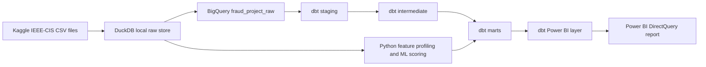

# Architecture

This project is structured as an analytics engineering pipeline, not as a notebook-only analysis. The goal is to move from raw competition data to tested analytical marts, model-driven risk scores, and an executive reporting layer.

## End-to-End Flow



## BigQuery Datasets

| Dataset | Purpose |
|---|---|
| `fraud_project_raw` | Raw Kaggle tables and model support outputs |
| `fraud_project_staging` | Typed and normalized source views |
| `fraud_project_intermediate` | Joined transaction and identity records with engineered features |
| `fraud_project_mart` | Reconciled fraud, segment, risk-band, time, amount, and quality marts |
| `fraud_project_powerbi` | DirectQuery-friendly reporting tables for Power BI |

## dbt Model Layers

| Layer | Main models | Responsibility |
|---|---|---|
| Staging | `stg_transactions`, `stg_identity` | Type casting, safe naming, TransactionDT-derived fields, amount-cent features |
| Intermediate | `int_fraud_joined`, `int_features` | Transaction and identity join, product/payment/email/device segmentation |
| Marts | `mart_*` | Fraud summary, risk bands, amount bands, daily drift, payment/email risk, quality checks |
| Power BI | `fact_train_transactions`, `pbi_*` | Executive KPIs, DirectQuery visual tables, watchlists, model operations, quality contracts |

## Reporting Design

The Power BI report should connect only to `fraud_project_powerbi`. Raw Kaggle tables and staging models are intentionally excluded from the report surface. This keeps the reporting model stable, understandable, and suitable for executive presentation.

## Quality Gates

- Source row-count tests verify Kaggle table completeness.
- Staging tests validate key fields, ranges, and transaction uniqueness.
- Reconciliation tests check fact and mart consistency.
- Risk-band tests enforce expected risk labels and monotonic behavior.
- Report-readiness tests verify that the Power BI reporting layer is complete.

Latest production verification:

```text
dbt build: PASS=123 WARN=0 ERROR=0 SKIP=0 NO-OP=1 TOTAL=124
Scope: 33 models, 90 data tests, 8 sources, 1 exposure
```
