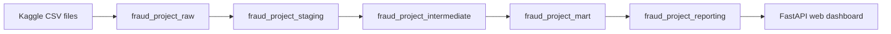

# BigQuery and dbt Lineage

## Dataset Flow

## Raw Layer

Dataset: `fraud_project_raw`

Purpose: store source Kaggle tables and model support outputs.

Key objects:

- `train_transaction`
- `train_identity`
- `test_transaction`
- `test_identity`
- `ml_predictions`
- `feature_importance`

## Staging Layer

Dataset: `fraud_project_staging`

Purpose: standardize source fields, apply type conversion, and expose clean source-aligned models.

Key models:

- `stg_transactions`
- `stg_identity`

## Intermediate Layer

Dataset: `fraud_project_intermediate`

Purpose: join transaction and identity records and derive reusable analytical features.

Key models:

- `int_fraud_joined`
- `int_features`

Feature examples:

- identity coverage flag
- amount band
- relative transaction day
- relative transaction hour
- card network and card type
- purchaser email group
- device type
- amount decimal group

## Mart Layer

Dataset: `fraud_project_mart`

Purpose: produce analytical tables for fraud metrics, segment comparison, model scores, risk bands, and data quality.

Key models:

- `mart_fraud_summary`
- `mart_daily_stats`
- `mart_amount_bands`
- `mart_product_device_stats`
- `mart_email_domain_stats`
- `mart_feature_missingness`
- `mart_model_predictions`
- `mart_risk_band_stats`
- `mart_identity_product_coverage`
- `mart_time_amount_signals`

## Reporting Layer

Dataset: `fraud_project_reporting`

Purpose: provide stable, pre-aggregated tables for the live web dashboard.

Key models:

- `fact_train_transactions`
- `rpt_executive_kpis`
- `rpt_segment_watchlist`
- `rpt_product_risk`
- `rpt_identity_risk`
- `rpt_amount_bands`
- `rpt_daily_drift`
- `rpt_payment_heatmap`
- `rpt_email_domain_risk`
- `rpt_model_risk_bands`
- `rpt_threshold_simulation`
- `rpt_review_strategy`
- `rpt_quality_contract`
- `rpt_report_readiness`

## Quality Controls

The dbt test suite validates:

- source row counts
- transaction ID uniqueness
- fraud label accepted values
- fact-to-source reconciliation
- daily statistics reconciliation
- model score coverage
- risk-band completeness
- risk-band monotonicity
- threshold simulation business rules
- reporting contract readiness
- English-only reporting contract values

This gives the dashboard a tested data contract instead of ad-hoc chart queries.
