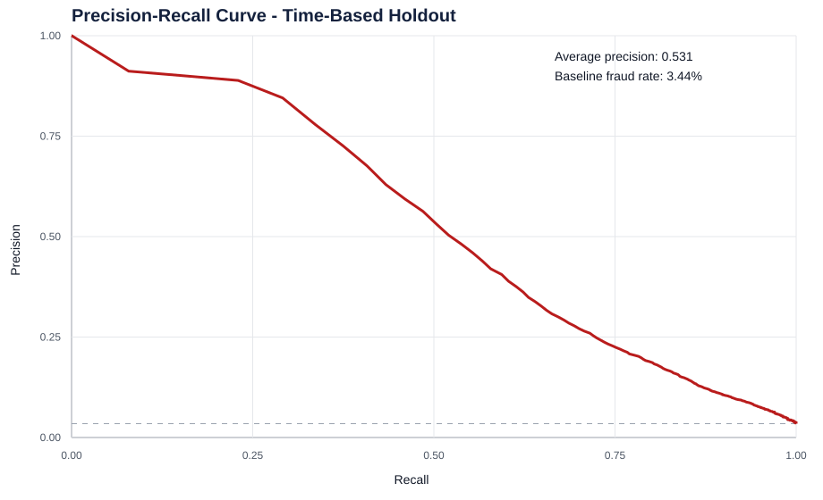

# Model Validation Evidence

## Validation Design

The model is evaluated with a chronological holdout:

- Training window: first 80% of train transactions by `TransactionDT`.
- Validation window: final 20% of train transactions by `TransactionDT`.

The project does not use random k-fold validation because random splits can leak temporal fraud patterns and overstate model quality in this dataset.

## Core Metrics

| Metric | Value | Interpretation |
|---|---:|---|
| ROC-AUC | 0.9134 | Ranking quality across thresholds |
| Average precision / AUC-PR proxy | 0.5354 | More relevant than accuracy for 3.5% fraud prevalence |
| Validation fraud baseline | 3.44% | Precision baseline for the holdout set |
| Top 10% validation score lift | 7.12x | Top-score decile fraud rate vs. validation baseline |
| Top 5% validation precision | 40.13% | Precision in the focused top-score validation band |
| Top 5% validation recall | 58.32% | Fraud capture in the focused top-score validation band |
| Top 5% validation false-positive rate | 3.10% | Legitimate validation transactions flagged by the focused band |
| Top 5% validation workload share | 5.00% | Share of validation transactions flagged by the focused band |
| Fixed 0.50 threshold precision | 25.68% | Precision under a fixed probability threshold |
| Fixed 0.50 threshold recall | 69.78% | Fraud capture under a fixed probability threshold |

The reporting-score risk bands remain useful for segmentation, but the validation metrics above should be used when discussing model generalization.

## Precision-Recall Curve

## Class Imbalance Treatment

The fraud rate is approximately 3.5%, so accuracy is not used as a success metric. The model and reporting layer use:

- ROC-AUC for ranking quality.
- Average precision / PR behavior for imbalance-aware evaluation.
- Workload share to connect model thresholds to capacity.
- Precision, recall, and false-positive rate at operating thresholds.
- Lift to explain concentration in the highest-score population.

## Cross-Validation Position

Current implementation:

- Single chronological holdout using the final 20% of `TransactionDT`.
- This is leakage-safer than random k-fold and aligns with fraud monitoring chronology.

Recommended next experiment:

- Add expanding-window time-based cross-validation.
- Report mean and standard deviation for ROC-AUC, AUC-PR, recall, false-positive rate, and lift.
- Compare against the current single-holdout result before changing model policy.

